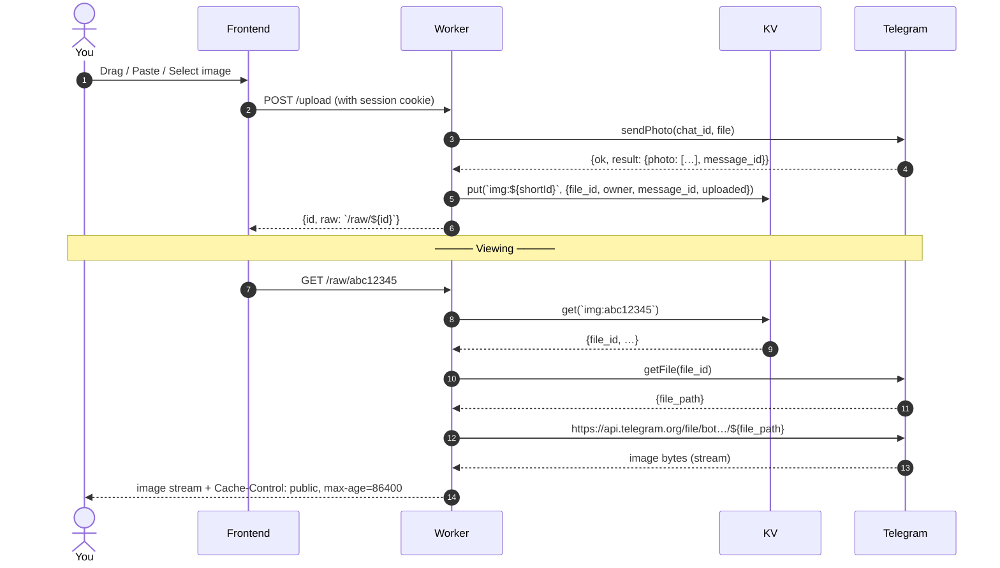

# 📸 Pichost – Infinite(ish) Image Hosting

Powered by Cloudflare Workers, Cloudflare KV, and Telegram's very generous (and free) file infrastructure.


Tired of paying for S3 / Cloudinary / Imgix / ... ?  
Ever looked at Telegram and thought:  
“This thing has unlimited storage and a CDN — why not abuse it politely?”

Welcome to **Pichost** — a clean, fast, personal image host that treats Telegram like a free object store.

## 🧠 How the magic actually works

1. You upload → image goes to your private Telegram channel via bot  
2. Metadata (file_id + owner) saved in Cloudflare KV  
3. Viewing → Worker asks Telegram for temporary file URL → streams directly through Cloudflare Edge (with caching)

Cloudflare **never** stores or buffers the full image — pure proxy + edge cache bliss.



## ✨ Features (what’s actually implemented)

- **Zero storage cost** — Telegram pays the bill
- Authentication:
  - Username + password (stored as SHA-256 hash in KV)
  - “Sign in with Google” (OAuth ID token validation)
- Modern single-file frontend (no build tools, no npm)
- Drag & drop + Ctrl+V (paste) support
- Responsive gallery with lazy loading
- One-click copy link / view full / delete (owner only)
- Dark mode (system + manual toggle)
- 4 accent colors: blue (default), emerald, violet, rose
- Glassmorphism + Lucide icons
- Edge-cached image delivery via Cloudflare
- Session cookie (HttpOnly, Secure, SameSite=None)

## 🚨 THE GREAT PRIVACY WARNING 🚨

When you first open `index.html`, it points to the demo backend:

**https://pichost.vivekpereiraalbert.workers.dev**

→ Feel free to test everything instantly (drag images, try Google login, etc.).

**BUT — very important:**

Every image you upload through this default backend lands in **my** private Telegram channel.  
Technically I **can** see them.

I’m not watching and I don’t care about your memes — but privacy matters.

**Strong recommendation:**  
Deploy your own Worker + KV + Telegram bot/channel (takes ~10–15 min).  
Then change the backend URL in the **Settings** tab (or pre-settings modal).

Your images → your channel → only you can see them (and anyone you give the direct `/raw/xxxxxx` link to).

## 🛠️ Setup – 4 steps, mostly copy-paste

### 1. Telegram Bot & Channel

1. Talk to **@BotFather** → `/newbot` → copy **Bot Token**
2. Create a **private** channel
3. Add your bot as **Administrator** (must allow posting & deleting)
4. Get **Chat ID**:

   * Forward any message from the channel to **@userinfobot**
   * It usually looks like `-1001234567890`

---

### 2. Deploy the Backend (Cloudflare Workers)

You can deploy the backend in two ways.

#### ⚡ Option A — One-Click Deploy (recommended)

This will automatically:

* Deploy the `worker.js` backend
* Ask your **Telegram Bot Token**
* Ask your **Telegram Chat ID**
* Create and bind the **IMG_KV** namespace

Click below and follow the prompts:

[](https://deploy.workers.cloudflare.com/?url=https://github.com/angel2rider/PicHost/tree/main/backend)

After deployment finishes, Cloudflare will give you a **Worker URL**, which will look like:

`https://pichost-yourname.workers.dev`

Save this — you'll need it for the frontend.

---

#### 🛠 Option B — Manual Deployment

1. Go to **Cloudflare Dashboard → Workers & Pages → Create Worker**
2. Give it a name (for example `pichost-myname`)
3. Open the Worker editor and replace the default code with the contents of **`backend/worker.js`**
4. Go to **Settings → Variables**
5. Add the following variables:

```
TELEGRAM_BOT_TOKEN = your bot token
TELEGRAM_CHAT_ID  = your channel ID (with the -100…)
```

6. Go to **Settings → KV Namespace**
7. Create a namespace named:

```
IMG_KV
```

8. Bind it to the Worker with variable name:

```
IMG_KV
```

9. Click **Deploy**

Once deployed, you will receive a Worker URL like:

`https://pichost-yourname.workers.dev`

---

### 3. Google Login (optional but nice)

1. Google Cloud Console → **APIs & Services** → **Credentials**
2. Create **OAuth 2.0 Client ID** → Web application
3. Add **Authorized JavaScript origins**:

   * `https://your-domain.pages.dev` (or `http://localhost:5500` etc.)
4. Copy **Client ID**
5. Paste it into `index.html` line containing:
   `const GOOGLE_CLIENT_ID = "…";`

---

### 4. Frontend

1. Save `index.html` somewhere
2. Serve it properly (cookies won’t work with `file://`):

   * VS Code Live Server
   * `npx serve`
   * Cloudflare Pages / Vercel / Netlify / GitHub Pages
3. Open → if backend not set → pre-settings modal appears → enter your Worker URL

Done. Upload away.

## 🛑 Real Limitations

- Telegram Bot API: **20 MB** per file (photo)
- Images are **public by link** — `/raw/xxxxxx` is guessable (8-char short ID)  
  → great for sharing, terrible for private documents
- No bulk delete / folders / search (yet)
- Abuse Telegram too hard → bot/channel can get banned
- KV list operation limited to 1000 keys per call (pagination not implemented)

Use responsibly — personal use, portfolios, small projects, memes.

## 🙏 Big Thanks To

- **Telegram** — for absurdly generous free file hosting & CDN
- **Cloudflare** — free Workers, KV, edge caching/streaming

## 👨‍💻 Author

Made with ☕, rage against cloud bills, and questionable life choices  
by **Vivek Pereira Albert** (@TheGT2Angel)

**License**  
[MIT](./LICENSE) — fork it, break it, host cat pictures with it — just don’t blame me when Telegram eventually notices.

Enjoy your $0 storage. 🚀
